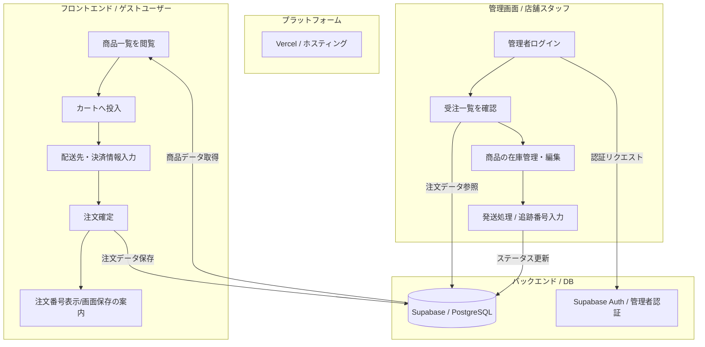

# なにわセレクトショップ EC システム 要件定義書

## ドキュメント管理情報

| 項目 | 内容 |
| :--- | :--- |
| 文書番号 | REQ-NANIWA-EC-002 |
| バージョン | 2.0 |
| 作成日 | 2026年3月23日 |
| 最終更新日 | 2026年3月23日 |
| 作成者 | いちごチーム |
| ステータス | 構成変更反映済み（確定）・スコープ詳細変更済み |

---

## 目次

1. [プロジェクト概要](#1-プロジェクト概要)
2. [システム構成](#2-システム構成)
3. [機能要件](#3-機能要件)
4. [非機能要件](#4-非機能要件)
5. [データ要件](#5-データ要件)
6. [外部インターフェース](#6-外部インターフェース)
7. [制約条件](#7-制約条件)
8. [受入条件](#8-受入条件)
9. [改訂履歴](#9-改訂履歴)

---

## 1. プロジェクト概要

### 1.1 プロジェクト名
なにわセレクトショップ EC システム

### 1.2 プロジェクトの背景
現在、なにわセレクトショップは実店舗での販売を中心に展開しているが、大阪の特産品・名産品を全国の顧客へ届けるべく、オンライン販売チャネルの構築を決定した。
これまでは電話とFAXで地方発送の注文を受けていたが、以下の深刻な課題が発生しており、業務効率化と顧客満足度向上のためにWebシステム化が急務となっている。

*   **受注機会の損失**: 営業時間外や定休日に注文を受け付けることができず、購入希望者を逃している。
*   **アナログ運用によるミス**: 在庫の数え間違いや、FAX注文用紙からの書き写しミスによる誤配送・欠品トラブルが発生している。
*   **連絡の遅延**: 発送完了の連絡を一件ずつ手動（電話等）で行っているため、お客様への通知が遅れ、問い合わせ対応の負担が増大している。

### 1.3 プロジェクトの目的
24時間365日注文可能な窓口を提供し、在庫管理および注文処理をデジタル化することで「ミス・漏れ・遅れ」のない迅速な販売体制を構築する。また、初学者チームによる開発であることを考慮し、まずは「ゲスト購入」という最小構成で早期のサービスインを目指す。

### 1.4 スコープ（業務要件）

#### 1.4.1 対象範囲
本システムで自動化・管理する業務範囲は以下の通りとする。
*   **商品公開業務**: 商品名、税込価格、在庫数の管理。
*   **受注業務**: Webサイトからの24時間注文受付、注文情報の自動DB登録。
*   **配送管理業務**: 管理画面での注文内容確認、追跡番号の紐付け、発送ステータスの更新。
*   **在庫管理業務**: 注文確定時の自動在庫減算、管理者による在庫数調整。

#### 1.4.2 対象外（将来対応）
以下の業務は本フェーズのスコープ外とし、従来通りアナログ運用または次期開発とする。
*   **おすすめ商品表示**: ショップがおすすめする商品3選を表示、編集する
*   **商品詳細**:商品の詳細を表示する
*   **商品画像登録**:商品一覧に画像を表示する
*   **会員登録・ログイン・マイページ**:会員登録済ユーザーはログイン後マイページで個人情報や注文履歴、配送状況について管理する
<!-- *   **高度な物流連携**: 運送会社のシステムとの直接的なデータ連携（API連携等）。 -->

---

## 2. システム構成

### 2.1 技術スタック
| 層 | 技術 | 選定理由 |
| :--- | :--- | :--- |
| フロントエンド | Next.js (App Router) + TypeScript | 学習資料が豊富であり、型安全な開発が可能。 |
| データベース | Supabase (PostgreSQL) | GUI（Dashboard）での操作が容易で、初学者に適している。 |
| 認証 | Supabase Auth | 管理者（Role: admin）のログイン認証に利用。 |
| 状態管理 | localStorage | ゲストユーザーのカート情報を一時保持するために使用。 |
| デプロイ | Vercel | GitHub 連携による自動デプロイが可能。 |

---

### 2.2 業務フロー・システム概略

## 3. 機能要件

### 3.1 画面一覧
| 画面ID | 画面名 | URL | 認証 | 概要 |
| :--- | :--- | :--- | :--- | :--- |
| SCR-01 | トップページ | `/` | 不要 | 商品一覧を表示 |
| SCR-03 | カート/購入画面 | `/cart` | 不要 | カート内容確認（削除ボタン有）、配送先・決済入力 |
| SCR-04 | 注文完了 | `/order-complete` | 不要 | 注文番号を表示 |
| SCR-06 | 管理者ログイン | `/admin/login` | 不要 | 管理者専用ログイン画面 |
| SCR-07 | 注文管理 | `/admin/orders` | 要(admin) | 全注文一覧（注文詳細・追跡番号入力）・配送ステータス変更 |
| SCR-08 | 商品管理 | `/admin/products` | 要(admin) | 商品一覧・新規追加・削除 |
<!-- | SCR-07 | 管理者ログイン | `/admin/login/top` | 要(admin) | 管理者専用管理画面（全注文一覧と商品一覧を表示） | -->
<!-- | SCR-09 | 商品編集画面 | `/admin/products/[id]` | 要(admin) | 特定商品の情報更新（価格・在庫等） | -->

### 3.2 顧客向け機能

#### 3.2.1 商品閲覧（SCR-01）
| 要件ID | 要件 |
| :--- | :--- |
| F-01-01 | 商品一覧を表示すること。 |
| F-01-02 | **全ての商品の価格を「税込」で表示すること。** |
| F-01-03 | 在庫 0 の商品は「売り切れ」表示とし、カート投入ボタンを無効化すること。 |
| F-01-04 | 「カートに入れる」ボタンクリックで localStorage に商品情報を保存すること。 |

#### 3.2.2 カート・購入処理（SCR-03 / 04）

| 要件ID | 要件 |
| :--- | :--- |
| F-03-01 | カート内の商品一覧（税込単価、数量、小計）を表示すること。 |
| F-03-02 | **商品ごとに「削除ボタン」を配置し、個別にカートから除去できること。** |
| F-03-03 | ＋/−ボタンで数量を変更し、合計（税込合計＋送料800円）を即座に再計算すること。 |
| F-03-04 | 配送先情報（氏名、郵便番号、住所、電話番号、メールアドレス）を入力できること。 |
| F-03-05 | 決済情報（カード16桁チェック）のモック画面を提供すること。 |
| F-03-06 | 注文確定時に「注文・明細作成」「在庫減算」「カートクリア」を一連の処理で行うこと。 |
| F-03-07 | **注文完了画面で「注文番号」を大きく表示し、後の問い合わせのために「画面保存（スクリーンショット）」を促す文言を表示すること。** |

### 3.3 管理者向け機能

#### 3.3.1 注文管理（SCR-07）

| 要件ID | 要件 |
| :--- | :--- |
| F-07-01 | 全ての注文履歴を一覧表示すること。 |
| F-07-02 | **表示必須項目：注文ID、注文日、顧客名、注文内容（全商品名・数量）、合計金額、追跡番号、ステータス。** |
| F-07-03 | 発送作業完了時に「追跡番号」を入力し、ステータスを「発送済み」に更新できること。 |

#### 3.3.2 商品管理（SCR-08 / 09）

| 要件ID | 要件 |
| :--- | :--- |
| F-08-01 | 商品の新規登録（商品名、税抜価格、在庫数）ができること。 |
| F-08-02 | **既存商品の情報を編集（商品編集画面）し、即座にサイトへ反映できること。** |
| F-08-03 | 商品の削除（論理削除）ができること。 |
| F-08-04 | 入力バリデーション（価格・在庫は 0 以上の整数のみ）を実装すること。 |

---

## 4. 非機能要件
| 要件ID | 要件 |
| :--- | :--- |
| NF-01 | 管理画面（`/admin/*`）は `role = 'admin'` を持つユーザーのみがアクセスできるよう、ミドルウェア等で制限すること。 |
| NF-02 | ゲストカート情報は、ユーザーがブラウザを閉じても保持されるよう localStorage を適切に活用すること。 |
| NF-03 | 金額表記は「¥」および「（税込）」をセットで明記し、ユーザーの誤解を防ぐこと。 |
| NF-04 | PCでカート操作や注文入力がストレスなく行えること。 |

---

## 5. データ要件
| テーブル名 | カラム定義（データ型・制約） | 備考 |
| :--- | :--- | :--- |
| **profiles** | `id(PK)`, `name`, `role(default: customer)` | ユーザー基本情報。権限管理を含む。 |
| **products** | `id(PK)`, `name`, `price(税抜き単価)`, `stock`, `is_featured`, `created_at` | 商品マスタ。在庫やおすすめフラグを保持。 |
| **orders** | `id(PK)`, `order_number(YYYYMMDD-連番)`, `customer_info(JSONB)`, `total_price(税込)`, `tracking_number`, `status`, `created_at` | 注文履歴。顧客情報は注文時のスナップショットを保持。 |
| **order_items** | `id(PK)`, `order_id(FK)`, `product_name`, `unit_price(税込)`, `quantity` | 注文明細。購入時の商品名と単価を記録。 |

---

## 6. 外部インターフェース
### 6.1 外部サービス連携
- **Supabase Auth**: 管理者のログイン管理。
- **Vercel**: GitHubと連携したホスティング環境。

---

## 7. 制約条件
- **技術的制約**: Supabase 無料枠（Free Tier）の範囲内で構築すること。
- **期間的制約**: 開発期間内にリリース可能な「ゲスト購入」優先のスコープを維持すること。

---

## 8. 受入条件

### 8.1 顧客フロー
| ID | テスト項目 | 期待結果 |
| :--- | :--- | :--- |
| AT-01 | 商品一覧表示 | 全商品が**税込価格**で表示され、在庫なし商品は購入不可であること。 |
| AT-02 | カート操作 | 商品の追加、数量変更、および**削除ボタンによる除去**が正常に行えること。 |
| AT-03 | 金額計算 | 税込小計と送料（800円）が正しく合算され、合計金額が表示されること。 |
| AT-04 | ゲスト注文完了 | **注文完了画面に注文番号と「画面保存のお願い」が正しく表示されること。** |

### 8.2 管理者フロー
| ID | テスト項目 | 期待結果 |
| :--- | :--- | :--- |
| AT-05 | 注文内容確認 | 管理画面で**注文ID、顧客名、注文された全商品の名称と個数**が確認できること。 |
| AT-06 | 発送ステータス更新 | 追跡番号を入力して更新すると、注文ステータスが「発送済み」に変わること。 |
| AT-07 | 商品管理（CRUD） | **新商品の登録、既存商品の価格（税込）や在庫の編集、削除**が正常に行えること。 |
| AT-08 | 権限定御 | 一般ユーザー（または未ログイン者）が管理画面URLを直接叩いてもリダイレクトされること。 |

---

## 9. 改訂履歴

| バージョン | 日付 | 変更内容 | 変更者 |
| :--- | :--- | :--- | :--- |
| 1.0 | 2026年3月19日 | 初版作成 | いちごチーム |
| 1.1 | 2026年3月19日 | ordersテーブルへのDEFAULT値追加等の微調整 | いちごチーム |
| 2.0 | 2026年3月23日 | **大幅改訂**: 会員機能の廃止、ゲスト購入化、管理機能(CRUD)の確定、税込表示・削除ボタン追加、背景・スコープ詳細加筆、注文完了画面の案内強化。 | いちごチーム |