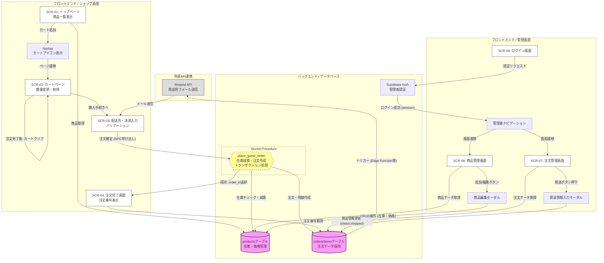

# なにわセレクトショップ EC システム 要件定義書

## ドキュメント管理情報

| 項目 | 内容 |
| :--- | :--- |
| 文書番号 | REQ-NANIWA-EC-004 |
| バージョン | 4.0 |
| 作成日 | 2026年3月26日 |
| 最終更新日 | 2026年3月26日 |
| 作成者 | いちごチーム |
| ステータス | 顧客フロー実装詳細反映済み（確定） |

---

## 1. プロジェクト概要

### 1.1 プロジェクト名
なにわセレクトショップ EC システム

### 1.2 プロジェクトの背景・目的
実店舗（大阪）の特産品を全国へ届けるためのECサイト構築。アナログ運用のミス（書き写しミスや在庫数え間違い）を排除し、24時間365日の自動受注体制を実現する。初学者チームであることを考慮し、会員登録を省いた「ゲスト購入」特化型とする。

### 1.3 スコープ
* **顧客機能**: 商品閲覧、カート管理（localStorage）、配送先・決済情報入力、RPCによる一括注文処理、注文番号表示。
* **管理機能**: 管理者認証、受注一覧（発送・キャンセル・追跡番号管理）、商品マスタ（CRUD）、自動発送通知メール送信。

---

## 2. システム構成

### 2.1 技術スタック
| 層 | 技術 | 詳細・選定理由 |
| :--- | :--- | :--- |
| フロントエンド | Next.js (App Router) | 高速な画面遷移とコンポーネントベースの開発。 |
| 状態管理 | Context API + localStorage | カート情報をブラウザに永続化（`CartProvider`）。 |
| データベース | Supabase (PostgreSQL) | 複雑な注文処理を `RPC (Stored Procedure)` で実装。 |
| 認証 | Supabase Auth | 管理者（`role: admin`）のログイン・アクセス制限。 |
| メール送信 | Resend API | 発送完了時の自動メール通知（追跡URL付き）。 |

### 2.2 業務フロー・システム概略

---

## 3. 機能要件

### 3.1 顧客向け機能

#### 3.1.1 商品一覧（SCR-01）
* **表示**: 商品名、税込価格（`formatPrice`整形）、在庫状況を表示。
* **制御**: 在庫 0 の商品は「売り切れ」バッジを表示し、カート追加ボタンを無効化。

#### 3.1.2 カート管理（SCR-03 / Context）
* **追加機能**: 商品ごとに在庫数を確認し、在庫を超える追加はエラーメッセージを表示。
* **編集機能**: カート内での数量変更（＋/－）および個別削除。
* **永続化**: ブラウザを閉じても `localStorage` によりカート内容を保持。

#### 3.1.3 購入手続き・バリデーション（SCR-03）
* **お届け先入力**: 名前、メール、郵便番号（自動ハイフン挿入）、住所、電話番号の入力。
* **決済情報**: クレジットカード番号（16桁、4桁ごとのスペース自動挿入）のモック入力。
* **バリデーション**:
    * メールアドレス形式（Regex）チェック。
    * 郵便番号（ハイフン込み8文字）チェック。
    * カード番号（16桁）チェック。
    * 各項目の未入力チェック。

#### 3.1.4 注文処理（Transaction）
* **Place Guest Order**: `supabase.rpc("place_guest_order")` を呼び出し、サーバー側で「注文作成」「明細作成」「在庫減算」をアトミックに実行。

#### 3.1.5 注文完了（SCR-04）
* **表示**: `order_id` に基づきDBから取得した「注文番号（#YYYYMMDD-連番）」を表示。
* **UX**: 注文受付済みステータスの表示と、トップページへの誘導。

### 3.2 管理者向け機能

#### 3.2.1 注文・配送管理（SCR-07）
* **ステータス管理**: `pending`（受付済）、`shipped`（発送済）、`cancelled`（キャンセル済）の3状態。
* **発送処理**: 配送業者（ヤマト・佐川・郵政）の選択と追跡番号入力。入力後、顧客へ自動メール送信。
* **キャンセル**: 受付済の注文に限り、在庫を戻さない形式での注文取り消しが可能。

#### 3.2.2 商品管理（SCR-08）
* **CRUD**: 商品の新規登録、価格（税抜）・在庫の編集、削除（confirm付き）。

---

## 4. データ要件（スキーマ定義）

| テーブル名 | カラム | 説明 |
| :--- | :--- | :--- |
| **products** | `id`, `name`, `price`, `stock` | `price`は税抜価格。 |
| **orders** | `id`, `order_number`, `status`, `total` | `guest_email`, `shipping_address` 等を含む。 |
| **order_items** | `order_id`, `product_name`, `quantity` | 購入時の税込単価（`unit_price`）を記録。 |

---

## 5. 非機能要件

### 5.1 UI/UX（ユーザビリティ）
* **和風モダンデザイン**: `Noto Serif JP` を採用し、大阪のセレクトショップらしい「信頼感」と「上質感」を演出する。
<!-- * **レスポンシブ対応**: PCおよびスマートフォン（iPhone/Android）の主要ブラウザで、崩れのない最適なレイアウトを提供。 -->
* **リアルタイムフィードバック**:
    * 郵便番号のハイフン自動挿入（3桁-4桁）。
    * クレジットカード番号の4桁ごとのスペース挿入。
    * 数量変更時の小計・合計金額の即時反映。
* **アクセシビリティ**: ボタンサイズを適切に保ち（最小 44x44px）、視認性の高いコントラスト比を維持する。

### 5.2 信頼性・堅牢性
* **二重決済の防止**: 注文ボタン押下直後に `loading` 状態を `true` にし、ボタンを非活性化（disabled）することで、連打による多重注文を防ぐ。
* **トランザクション管理**: SupabaseのRPC（Stored Procedure）を利用し、在庫の減算と注文明細の作成を単一のトランザクションとして実行。一部が失敗した場合は全処理をロールバックする。
* **データの永続化**: カート情報は `localStorage` に保存し、ブラウザを閉じたりページを更新したりしても内容が保持されるようにする。

### 5.3 セキュリティ
* **管理者認証**: `/admin` 以下の全ルートに対し、Supabase Auth によるセッションチェックを実装。未ログイン時は `/login` へリダイレクトする。
* **入力値のサニタイズ**: 配送先情報およびクレジットカード情報の入力フォームに対し、スクリプト注入（XSS）等の攻撃を防ぐための適切なエスケープ処理を行う。
* **決済情報の取り扱い**: 本システムはモック決済を想定しており、クレジットカード番号はデータベースに保存せず、処理完了後にメモリから破棄する。

### 5.4 運用・保守
* **パフォーマンス**: Next.js の App Router を活用し、画像最適化やコンポーネントのサーバーサイド/クライアントサイドの適切な切り分けにより、初回読み込み速度（LCP）を高速化する。
* **スケーラビリティ（制限事項）**: Supabase の Free Tier 枠内での運用を想定。同時接続数やデータベース容量（500MB）を監視し、必要に応じて上位プランへの移行を検討する。
* **エラーハンドリング**: 
    * ネットワークエラー発生時、ユーザーに「時間をおいて再度お試しください」等の適切なメッセージを表示。
    * 商品在庫が決済直前で切れた場合の排他制御とエラー通知。

### 5.5 環境要件
* **対応ブラウザ**: Google Chrome (最新版), Safari (最新版), Microsoft Edge (最新版)。
* **稼働時間**: 24時間365日（Supabase の稼働状況に準ずる）。

---

## 6. 受入条件

### 6.1 顧客フロー
| ID | テスト項目 | 期待結果 |
| :--- | :--- | :--- |
| AT-01 | 商品一覧表示 | 全商品が**税込価格**（`taxIncluded`適用）で表示され、在庫なし商品は「売り切れ」となり購入不可であること。 |
| AT-02 | カート操作 | 商品の追加、数量変更（在庫上限まで）、および**削除ボタンによる除去**が正常に行え、表示に即時反映されること。 |
| AT-03 | 金額計算 | 税込小計と送料（`SHIPPING_FEE`: 800円）が正しく合算され、合計金額が表示されること。 |
| AT-04 | 入力フォーマット | 郵便番号（ハイフン自動挿入）およびカード番号（4桁毎スペース）の入力補助が機能すること。 |
| AT-05 | ゲスト注文完了 | `place_guest_order`経由でDB保存され、**注文完了画面に「注文番号」と「発送通知に関する案内」が正しく表示されること。** |

### 6.2 管理者フロー
| ID | テスト項目 | 期待結果 |
| :--- | :--- | :--- |
| AT-06 | 注文内容確認 | 管理画面で**注文ID、顧客名（配送先情報）、注文された全商品の名称と個数、合計金額**が確認できること。 |
| AT-07 | 発送ステータス更新 | 配送業者選択と追跡番号を入力して更新すると、ステータスが「発送済み」に変わり、顧客へ通知が飛ぶ状態になること。 |
| AT-08 | 商品管理（CRUD） | **新商品の登録、既存商品の価格（税抜設定・税込表示）や在庫数の編集、削除**が正常に行えること。 |
| AT-09 | 権限定御 | Supabase Authにより、未ログイン者または管理者権限のないユーザーが管理画面URLを直接叩いてもリダイレクト（拒否）されること。 |
---

## 7. 改訂履歴

| バージョン | 日付 | 変更内容 | 変更者 |
| :--- | :--- | :--- | :--- |
| 1.0 | 2026年3月19日 | 初版作成。会員登録制を想定したECサイトの基本設計を定義。 | いちごチーム |
| 1.1 | 2026年3月19日 | ordersテーブルへのDEFAULT値追加、DBスキーマの微調整。 | いちごチーム |
| 2.0 | 2026年3月23日 | **大幅改訂**: 会員機能の廃止、ゲスト購入特化型へシフト。管理機能(CRUD)の確定、税込価格計算ロジック、カート削除ボタンの追加。背景・スコープ詳細を加筆し、注文完了画面の案内を強化。 | いちごチーム |
| 3.0 | 2026年3月25日 | **実装詳細の統合**: localStorageによるカート永続化、Context APIによる状態管理、Supabase RPCを用いた在庫減算・注文一括処理のフローを追加。 | いちごチーム |
| 4.0 | 2026年3月26日 | **最終仕様反映**: 郵便番号・カード番号のリアルタイムフォーマット実装、および最新のソースコード（CartPage, OrderCompletePage等）に基づき受入条件を精緻化。 | いちごチーム |