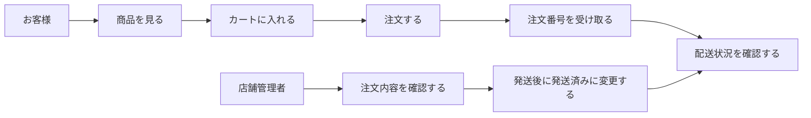
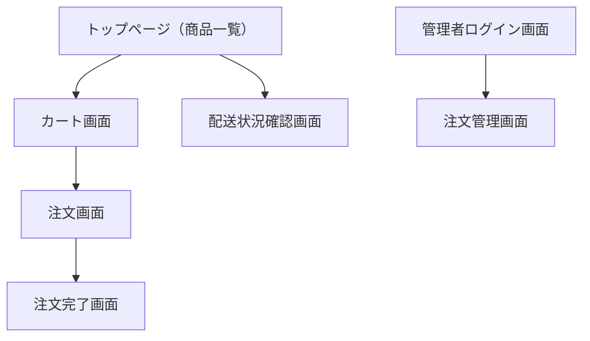
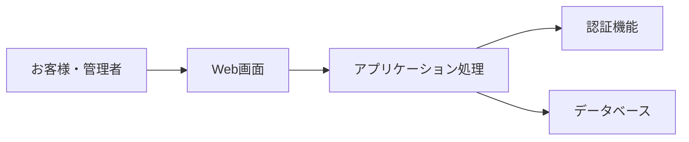

# なにわセレクトショップ オンライン販売システム

## 初期提案書

**作成日**：2026年3月19日
**作成者**：いちごチーム

---

## 1. 提案概要

本提案は、なにわセレクトショップ様の商品をオンラインで販売できるようにするための販売システム構築に関する初期提案です。

現在、電話やFAXで行っている注文受付をWeb化することで、営業時間外の注文受付を可能にし、注文内容の記録や確認をしやすくすることを目的としています。
また、店舗側が注文状況を画面上で確認・更新できるようにすることで、運用負荷の軽減や業務の効率化につなげることを目指します。

本提案書では、以下の観点からシステムの全体像をご提示します。

* 利用イメージ
* 機能一覧
* 機能詳細
* 画面一覧
* 画面遷移
* 今回の開発対象
* 今後の展望
* ご確認いただきたい事項

なお、本資料は初期提案段階の内容であり、詳細な仕様や画面内容については、今後のお打ち合わせを通じて調整・確定していく想定です。

---

## 2. 利用イメージ

本システムでは、主に「お客様が商品を注文する流れ」と「店舗側が注文を確認し、配送状況を更新する流れ」を想定しています。

※PCブラウザから利用することを想定

### 利用イメージの概要

* お客様は商品一覧から商品を選び、カートに入れて注文します
* 注文後は注文番号をもとに配送状況を確認できます
* 店舗管理者は管理画面から注文内容を確認し、発送後に配送状況を更新します

---

## 3. 機能一覧

本システムで提供する主要機能は以下の通りです。

| 機能分類  | 機能名      | 概要                    |
| ----- | -------- | --------------------- |
| 顧客向け  | 商品一覧機能   | 販売中の商品を一覧表示する         |
| 顧客向け  | カート機能    | 商品を一時保持し、購入内容を確認する    |
| 顧客向け  | 注文機能     | 配送先情報・決済情報を入力し注文を確定する |
| 顧客向け  | 配送状況確認機能 | 注文番号と電話番号で配送状況を確認する   |
| 管理者向け | 管理者認証機能  | 管理者画面へのログインを行う        |
| 管理者向け | 注文管理機能   | 注文内容の確認、配送状況の更新を行う    |

---

## 4. 機能詳細

### 4.1 商品一覧機能

お客様が販売中の商品を一覧で確認できる機能です。

#### 主な内容

* 商品一覧表示
* 在庫状態表示
* カート追加

#### 表示項目

* 商品名
* 価格
* 在庫状態
* カート追加ボタン

#### 想定仕様

* 在庫が0の商品は「売り切れ」と表示し、購入不可にする
* カート追加ボタンから商品をカートへ投入できる

---

### 4.2 カート機能

お客様が購入予定の商品を一時的に保持し、注文前に内容を確認するための機能です。

#### 主な内容

* 商品保持
* 数量変更
* 合計金額表示

#### 表示項目

* 商品名
* 単価（税抜き）
* 数量
* 小計（税抜き）
* 合計金額（税込み）
* 注文確定ボタン

#### 想定仕様

* 同一商品を追加した場合は数量を加算する
* 数量変更時に合計金額を再計算する
* 数量を0にした場合は、該当商品をカートから削除したものとして扱う
* カートが空の場合は専用メッセージを表示する

---

### 4.3 注文機能

お客様が配送先情報および決済情報を入力し、注文を確定する機能です。

#### 主な内容

* 配送先情報入力
* 決済情報入力
* 注文確定
* 注文番号発行

#### 入力項目

* 氏名
* 郵便番号
* 住所
* 電話番号
* メールアドレス
* クレジットカード番号

#### 想定仕様

* 今回は実際のクレジットカード会社との決済連携は行わず、**カード番号を入力したうえで決済ボタンを押下すると、決済完了として注文を受け付ける方式**とする
* 注文確定時に注文番号を自動発行する
* 注文完了画面に注文番号を表示する
* 注文情報は管理画面から確認できるよう保存する

---

### 4.4 配送状況確認機能

お客様が注文後に配送状況を確認するための機能です。

#### 主な内容

* 注文番号入力
* 電話番号入力
* 配送状況表示

#### 入力項目

* 注文番号
* 電話番号

#### 表示項目

* 注文番号
* 注文日
* 配送状況

#### 想定仕様

* 注文番号と電話番号が一致した場合のみ注文情報を表示する
* 配送状況は「注文受付済み」「発送済み」を表示する
* 他人の注文情報を容易に閲覧できないよう、注文番号のみではなく電話番号も照合条件とする

---

### 4.5 管理者認証機能

管理者が管理画面へログインするための機能です。

#### 主な内容

* 管理者ログイン
* 管理者画面への遷移
* 未認証時のアクセス制御

#### 想定仕様

* 管理者専用ログイン画面を用意する
* 認証成功時は管理者画面へ遷移する
* 認証失敗時はエラーメッセージを表示する
* 未認証の状態で管理画面へアクセスした場合はログイン画面へ遷移する

---

### 4.6 注文管理機能

管理者が注文内容を確認し、配送状況を更新するための機能です。

#### 主な内容

* 注文一覧表示
* 注文詳細確認
* 配送状況変更

#### 表示項目

* 注文番号
* 注文日
* 注文者名
* 注文商品
* 合計金額（税抜き・税込み）
* 配送先情報
* 配送状況

#### 想定仕様

* 注文が入ると管理画面に一覧表示される
* 発送完了後、管理者が配送状況を「発送済み」に変更できる
* 更新された配送状況は配送状況確認画面にも反映される

---

## 5. 画面一覧

想定している主な画面は以下の通りです。

| 画面名       | 概要                    | 利用者 |
| --------- | --------------------- | --- |
| トップページ    | 商品一覧を表示する画面           | お客様 |
| カート画面     | カート内商品を確認する画面         | お客様 |
| 注文画面      | 配送先・決済情報を入力する画面       | お客様 |
| 注文完了画面    | 注文完了後に注文番号を表示する画面     | お客様 |
| 配送状況確認画面  | 注文番号・電話番号で配送状況を確認する画面 | お客様 |
| 管理者ログイン画面 | 管理者専用ログイン画面           | 管理者 |
| 注文管理画面    | 注文確認と配送状況更新を行う画面      | 管理者 |

---

## 6. 画面遷移図

### 画面遷移概要

* お客様はトップページ（商品一覧）から商品を選択し、カート、注文画面を経て注文完了へ進みます
* 注文後は配送状況確認画面から注文番号と電話番号で状況を確認できます
* 管理者は専用ログイン後、注文管理画面を利用します

---

## 7. 今回の開発対象

今回の開発対象は以下を想定しています。

| 区分    | 項目       | 内容                   |
| ----- | -------- | -------------------- |
| 開発対象  | 商品一覧機能   | 商品一覧表示、在庫状態表示、カート追加  |
| 開発対象  | カート機能    | 商品保持、数量変更、合計金額表示     |
| 開発対象  | 注文機能     | 配送先入力、決済入力、注文番号発行    |
| 開発対象  | 配送状況確認機能 | 注文番号・電話番号による配送状況確認   |
| 開発対象  | 管理者認証機能  | 管理者ログイン、管理画面へのアクセス制御 |
| 開発対象  | 注文管理機能   | 注文一覧確認、配送状況更新        |
| 今後の展望 | 商品画像表示   | 商品情報の見やすさ向上のための対応    |
| 今後の展望 | おすすめ商品表示 | おすすめ商品の優先表示          |
| 今後の展望 | 商品管理機能   | 商品の追加、編集、削除          |
| 今後の展望 | メール通知機能  | 注文確認や発送完了の通知         |
| 今後の展望 | 会員機能     | 会員登録、ログイン、注文履歴確認     |
| 今後の展望 | レスポンシブ対応     | スマートフォン・タブレット専用のレイアウト     |

---

## 8. 今後の展望

本提案では、限られた開発期間の中で基本機能を優先して実装する想定です。
そのため、以下の内容は今後の拡張候補として整理しています。

### 主な拡張候補

* 商品画像表示
* おすすめ商品表示
* 商品管理機能
* メール通知機能
* 会員機能

### 補足

* 商品画像表示により、商品内容をより視覚的に伝えやすくなります
* おすすめ商品表示により、店舗側が特に見せたい商品を目立たせることができます
* 商品管理機能により、店舗側で商品の入れ替えや価格変更を行いやすくなります
* 会員機能により、将来的には注文履歴確認などにも対応しやすくなります

---

## 9. 補足情報

### 9.1 参考：システム構成イメージ

本システムは、ブラウザから利用するWebシステムとして構築を想定しています。
参考として、内部構成のイメージを以下に記載します。

### 9.2 参考：使用予定技術

チーム内での開発想定として、以下の技術構成を予定しています。

| 項目      | 内容                   |
| ------- | -------------------- |
| フロントエンド | Next.js / TypeScript |
| データベース  | Supabase PostgreSQL  |
| DB操作    | Supabase JS Client   |
| 認証      | Supabase Auth        |
| スタイリング  | CSS Modules          |
| デプロイ    | Vercel               |

---

## 10. ご確認いただきたい事項
本提案内容について、今後の詳細化に向けて、以下の点をご確認いただけますと幸いです。

* 商品一覧に表示する価格は、税抜価格と税込価格のどちらを想定されているか

* 配送状況の確認方法は、注文番号と電話番号を入力して確認する方式で問題ないか

上記の確認事項をはじめ、詳細な仕様や表示内容につきましては、今後メール等で適宜ご相談しながら整理し、順次機能へ反映していく想定です。