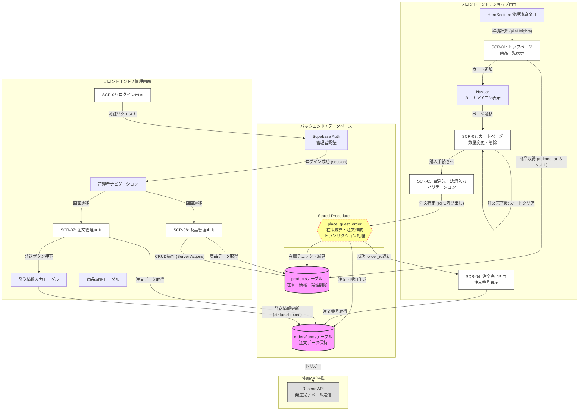

# なにわセレクトショップ EC システム 要件定義書

## ドキュメント管理情報

| 項目 | 内容 |
| :--- | :--- |
| 文書番号 | REQ-NANIWA-EC-005 |
| バージョン | 5.0 |
| 作成日 | 2026年3月27日 |
| 最終更新日 | 2026年3月27日 |
| 作成者 | いちごチーム |
| ステータス | 物理演算・最新Server Actions実装詳細反映済み（確定） |

---

## 1. プロジェクト概要

### 1.1 プロジェクト名
なにわセレクトショップ EC システム

### 1.2 プロジェクトの背景・目的
実店舗（大阪）の特産品を全国へ届けるためのECサイト構築。アナログ運用のミス（書き写しミスや在庫数え間違い）を排除し、24時間365日の自動受注体制を実現する。初学者チームであることを考慮し、会員登録を省いた「ゲスト購入」特化型とする。また、大阪らしい遊び心を演出するため、Canvasによる動的な物理演算演出を導入する。

### 1.3 スコープ
* **顧客機能**: 商品閲覧、物理演算演出（タコ落下・堆積）、カート管理（localStorage）、配送先・決済情報入力、RPCによる一括注文処理、注文番号表示。
* **管理機能**: 管理者認証（Supabase Auth）、受注一覧（発送・キャンセル・追跡番号管理）、商品マスタ（CRUD・論理削除対応）、自動発送通知メール送信。

---

## 2. システム構成

### 2.1 技術スタック
| 層 | 技術 | 詳細・選定理由 |
| :--- | :--- | :--- |
| フロントエンド | Next.js 14 (App Router) | 高速な画面遷移とServer Actionsによる堅牢なデータ処理。 |
| 物理演算 | Canvas API | カスタム2D物理エンジンによるインタラクティブな演出。 |
| 状態管理 | Context API + localStorage | カート情報をブラウザに永続化（`CartProvider`）。 |
| データベース | Supabase (PostgreSQL) | 複雑な注文・在庫処理を `RPC (Stored Procedure)` で実装。 |
| 認証 | Supabase Auth | 管理者（`role: admin`）のログイン・アクセス制限。 |
| メール送信 | Resend API | 発送完了時の自動メール通知（追跡URL付き）。 |

### 2.2 業務フロー・システム概略

---

## 3. 機能要件

### 3.1 顧客向け機能

#### 3.1.1 物理演算演出（HeroSection）
* **生成**: SPAWN_INTERVAL (210ms) ごとにタコ粒子を生成。
* **挙動**: 重力（GRAVITY: 0.014-0.024）、空気抵抗（AIR_DRAG: 0.992）、壁反発（WALL_BOUNCE: 0.46）を計算。
* **堆積**: 粒子速度が SETTLE_SPEED (0.34) 以下で静止し、フッターに積み重なる（pileHeights）。
* **透明度制御**: getParticleAlpha により、スクロール位置（Body=0.16, Footer=0.72）に応じて粒子の濃度を変化させ、可読性と演出を両立。

#### 3.1.2 商品一覧（SCR-01）
* **表示**: 商品名、税込価格（taxIncluded適用）、在庫状況を表示。
* **制御**: 在庫 0 の商品は「売り切れ」バッジを表示し、ボタンを無効化。論理削除された商品は非表示。

#### 3.1.3 カート管理（SCR-03 / Context）
* **追加機能**: 商品ごとに在庫数を確認。MAX_CART_QUANTITY (999) または在庫数を上限とする。
* **編集機能**: カート内での数量変更および個別削除。
* **永続化**: localStorage (Key: naniwa_cart) によりカート内容を保持。

#### 3.1.4 購入手続き・バリデーション（SCR-03）
* **お届け先入力**: 名前、メール、郵便番号（3-4桁自動ハイフン）、住所、電話番号の入力。
* **決済情報**: クレジットカード番号（4桁毎スペース自動挿入）のモック入力。
* **バリデーション**: メール形式(Regex)、郵便番号(8文字)、カード番号(16桁)、必須項目のチェック。

#### 3.1.5 注文処理（Transaction）
* **Place Guest Order**: supabase.rpc("place_guest_order") を呼び出し、サーバー側でアトミックに実行。
* **完了表示**: 注文IDに基づき、DBから取得した「注文番号」を表示。

### 3.2 管理者向け機能

#### 3.2.1 注文・配送管理（SCR-07）
* **ステータス管理**: pending（受付済）、shipped（発送済）、cancelled（キャンセル済）の管理。
* **発送処理**: 配送業者選択と追跡番号入力。更新後、Resend経由で顧客へ自動メール送信。
* **キャンセル**: 受付済の注文に限り、在庫を戻さない形式での注文取り消しが可能。

#### 3.2.2 商品管理（SCR-08）
* **CRUD**: 商品の新規登録、価格（税抜）・在庫・おすすめ設定（is_featured）の編集。
* **論理削除**: 物理削除は行わず、deleted_at カラムの更新によりショップ画面から非表示化する。

---

## 4. データ要件（スキーマ定義）

| テーブル名 | カラム | 説明 |
| :--- | :--- | :--- |
| **products** | id, name, price, stock, is_featured, deleted_at | priceは税抜価格。 |
| **orders** | id, order_number, status, total, guest_email, shipping_address | 注文基本情報。 |
| **order_items** | order_id, product_name, quantity, unit_price | 購入時の税込単価（unit_price）を記録。 |

---

## 5. 非機能要件

### 5.1 UI/UX（ユーザビリティ）
* **和風モダンデザイン**: Noto Serif JP を採用し、高級感と親しみやすさを演出する。
* **リアルタイムフィードバック**: 郵便番号・カード番号の自動フォーマット、数量変更時の即時金額反映。
* **リサイズ対応**: syncCanvas 関数により、画面サイズ変更時もCanvas解像度（DPR）を自動調整。

### 5.2 信頼性・堅牢性
* **二重決済防止**: 注文ボタン押下時に loading 状態を true にし、ボタンを非活性化。
* **トランザクション**: Supabase RPCを利用し、在庫減算と注文明細作成の整合性を保証。
* **計算精度**: taxIncluded による消費税（8%）の切り捨て処理の統一。

### 5.3 セキュリティ
* **管理者認証**: /admin 以下の全ルートに対し、Supabase Auth によるセッションチェックを実装。
* **サニタイズ**: フォーム入力に対するXSS対策エスケープ処理。
* **決済情報**: クレジットカード番号はDBに保存せず、メモリ上でのみ処理。

### 5.4 運用・保守
* **パフォーマンス**: Canvasの同時粒子数を120に制限し、ブラウザ負荷を抑制。
* **スケーラビリティ**: Supabase Free Tier 内での運用監視。

---

## 6. 受入条件

### 6.1 顧客フロー

| ID | テスト項目 | 期待結果 |
| :--- | :--- | :--- |
| AT-01 | 商品一覧表示 | 全商品が税込価格で表示され、在庫なし商品は「売り切れ」となり購入不可であること。 |
| AT-02 | 物理演算挙動 | タコが落下し、フッターに堆積すること。スクロールで透明度が変化（減衰）すること。 |
| AT-03 | カート操作 | 商品の追加、数量変更、削除が正常に行え、localStorageに保存されること。 |
| AT-04 | 注文完了 | place_guest_order経由で注文が完了し、注文番号（#～）が表示されること。 |

### 6.2 管理者フロー

| ID | テスト項目 | 期待結果 |
| :--- | :--- | :--- |
| AT-05 | 発送ステータス更新 | 追跡番号入力後、ステータスが「発送済み」となり、顧客へ通知が飛ぶ状態になること。 |
| AT-06 | 商品論理削除 | 商品管理から削除を実行すると、ショップ画面から即座に非表示になること（DB上は保持）。 |

---

## 7. 改訂履歴

| バージョン | 日付 | 変更内容 | 変更者 |
| :--- | :--- | :--- | :--- |
| 1.0 | 2026年3月19日 | 初版作成。会員登録制を想定したECサイトの基本設計を定義。 | いちごチーム |
| 1.1 | 2026年3月19日 | ordersテーブルへのDEFAULT値追加、DBスキーマの微調整。 | いちごチーム |
| 2.0 | 2026年3月23日 | 大幅改訂: 会員機能の廃止、ゲスト購入特化型へシフト。管理機能(CRUD)の確定、税込価格計算ロジック、カート削除ボタンの追加。 | いちごチーム |
| 3.0 | 2026年3月25日 | 実装詳細の統合: localStorageによるカート永続化、Context APIによる状態管理、Supabase RPCを用いた在庫減算フローを追加。 | いちごチーム |
| 4.0 | 2026年3月26日 | 最終仕様反映: 郵便番号・カード番号のリアルタイムフォーマット実装、およびソースコードに基づき受入条件を精緻化。 | いちごチーム |
| 5.0 | 2026年3月27日 | 最新仕様統合: Canvas物理演算詳細（Gravity, Sway, Alpha減衰）、商品論理削除、最新Server Actionsロジックを全面反映。 | いちごチーム |